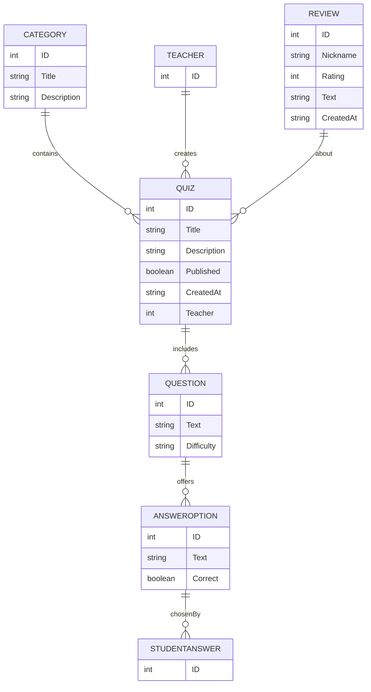

# Quizzer

**Quizzer** is a web-based quiz application designed for teachers and students at Haaga-Helia.  
Teachers can create and manage quizzes, questions, and categories through a teacher dashboard.  
Students can take published quizzes, get instant feedback, and write reviews in the student dashboard.  
The goal of the project is to make learning more interactive and provide a practical software development experience for the team.

**Frontend Production URL:** https://quizzer-778l.onrender.com/quizzes

---

## Team members

- [Maab Osman](https://github.com/maabosman)  
- [Bhavi Kataria](https://github.com/BhaviK06)  
- [Ali Eray Demir](https://github.com/alieraydemir080504)  
- [Prashoon Jha](https://github.com/prashoonjha)  
- [Emanuela](https://github.com/emalle)  
- [Mohammad Hanif Arghushi](https://github.com/MohammadHanifArghushi)  
- [An Le](https://github.com/chopiean)  
- [Lam Ting Hin Osman](https://github.com/osmanlam)

---

## Additional Information

**Team name:** QuizMasters  
**Team Size:** 8  
**Communication platforms:** Microsoft Teams & WhatsApp  
**Tech stack:** Backend – Java (Spring Boot), Frontend – React (TypeScript)


---

## Backlog

Project backlog:  
https://github.com/orgs/Project-Quiz-Masters/projects/5/views/1

---

## Developer Guide

Below are the implementation technologies and setup instructions for local development.

### Running Tests from the Command Line

The backend integration tests can be run using the Maven Wrapper.

On Windows (PowerShell or Command Prompt):
```
./mvnw.cmd test
```

On macOS / Linux:
```
./mvnw test
```

All tests use a separate in-memory H2 test database configured in:

```
src/test/resources/application.properties
```

This ensures that running tests does not affect the development or production database.


### Backend

#### Technologies

- Programming language: Java 21  
- Frameworks: Spring Boot (Maven project)  
- Major libraries: Spring Web, Spring Data JPA, SpringDoc/OpenAPI (Swagger), H2  
- Databases: H2 (development), PostgreSQL (production)

**RAHTI Production URL**: https://rahti-quizzer-quizzer-postgres.2.rahtiapp.fi/quizzes  
**Swagger (Production)**: link to the Swagger documentation deployed to the production environment in Rahti

#### ER Diagram



#### Running the Backend

1. Clone the repository:

   ```
   git clone https://github.com/Project-Quiz-Masters/Quizzer.git
   ```

2. Navigate to the project and pull the latest code:

   ```
   cd Quizzer
   git checkout main
   git pull
   ```

3. Build:

   ```
   mvn clean install
   ```

4. Run:

   ```
   mvn spring-boot:run
   ```

Backend runs at:

```
http://localhost:8080
```

H2 console:

```
http://localhost:8080/h2-console
```

---

### Frontend

#### Technologies

- Programming language: TypeScript  
- Frameworks: React (Vite)  
- Major libraries: React Router, Fetch API/axios (service calls)

#### Running the Frontend

The frontend source is in the `student-frontend` folder.

1. Navigate to the frontend folder:

   ```
   cd student-frontend
   ```

2. Install dependencies (first run or after dependency changes):

   ```
   npm install
   ```

3. Start the development server (runs on port 5173):

   ```
   npm run dev
   ```

   Open: `http://localhost:5173`

4. Build production assets:

   ```
   npm run build
   ```

5. Preview the production build locally:

   ```
   npm run preview
   ```

Frontend production (Render): `https://quizzer-778l.onrender.com/quizzes`

---

# API Documentation

These endpoints come directly from the backend implementation.

---

# Quiz API

Base: `/api/quizzes`

- **GET** `/api/quizzes` — Get all published quizzes  
- **GET** `/api/quizzes/{quizId}` — Get quiz by ID  
- **POST** `/api/quizzes` — Create quiz  
- **PUT** `/api/quizzes/{quizId}` — Update quiz  
- **DELETE** `/api/quizzes/{quizId}` — Delete quiz  
- **PUT** `/api/quizzes/{quizId}/category` — Assign category to quiz  

---

# Category API

Base: `/api/categories`

- **GET** `/api/categories/{categoryId}` — Get category  
- **POST** `/api/categories` — Create category  
- **PUT** `/api/categories/{categoryId}` — Update category  
- **DELETE** `/api/categories/{categoryId}` — Delete category  
- **GET** `/api/categories/{categoryId}/quizzes` — Published quizzes in a category  

---

# Question API

- **GET** `/api/quizzes/{quizId}/questions` — Get questions for quiz  
- **GET** `/api/questions/{questionId}` — Get question  
- **POST** `/api/quizzes/{quizId}/questions` — Create question  
- **PUT** `/api/questions/{questionId}` — Update question  
- **DELETE** `/api/questions/{questionId}` — Delete question  
- **DELETE** `/api/quizzes/{quizId}/questions/{questionId}` — Delete question from quiz  

---

# Answer Option API

- **GET** `/api/questions/{questionId}/answer-options` — List answer options  
- **POST** `/api/questions/{questionId}/answer-options` — Create answer option  
- **DELETE** `/api/questions/{questionId}/answer-options/{answerOptionId}` — Delete answer option  

---

# Student Answer API

- **POST** `/api/student-answers` — Submit single answer  
- **GET** `/api/student-answers/quiz/{quizId}/results` — Quiz results  
- **POST** `/api/student-answers/submit` — Submit full quiz attempt  

---

# Running the Full System

1. Start backend on port **8080**  
2. Start frontend on port **5173**  
3. Frontend communicates with backend via:

```
http://localhost:8080/api/...
```

---

# External Links

**RAHTI Production Environment:**  
https://rahti-quizzer-quizzer-postgres.2.rahtiapp.fi/quizzes  

**Flinga Board:**  
https://edu.flinga.fi/s/EXCBP45

# License

Licensed under the GNU GPL v3.0 – see the **[LICENSE](https://github.com/Project-Quiz-Masters/Quizzer/blob/main/LICENSE)** file.


